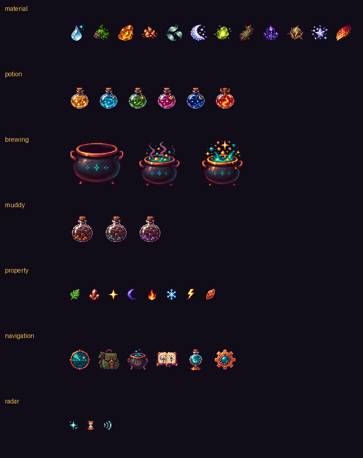

<p align="right">
  <a href="README.zh_CN.md">简体中文</a> · <strong>English</strong>
</p>

# Pocket Alchemist: Final Product Specification

Pocket Alchemist is an offline exploration and brewing game for FoloToy AI Passport. Nearby Wi-Fi and Bluetooth signals become resource points. The player moves, approaches signals, and spends time exploring to collect materials, then combines four owned materials at a registered laboratory. Attribute rules determine the resulting potion, and successful combinations fill the recipe book.

This document defines the current product, interface, gameplay, and technical behavior. It describes the finished implementation only.

## Product boundaries

- Target hardware: ESP32-C3, 8 MB Flash, no PSRAM, 240 × 320 portrait display, and three UP/DOWN/OK function buttons.
- The game runs fully offline. Scanning never connects to Wi-Fi and stores no wireless password.
- Wi-Fi and Bluetooth LE are used only for resource discovery, laboratory verification, and nearby potion display.
- Player state is stored in on-device Flash without an account or cloud service.
- The interface uses Simplified Chinese text, pixel-art illustrations, and a dark alchemy theme.

## Core loop

1. Scan nearby Wi-Fi in Settings and register one real SSID as the laboratory.
2. Enter Material Exploration, move with the device, and approach signal sources.
3. Collect a material after signal, movement, and exploration-time requirements are all met.
4. Return to the registered location and place four owned materials into the cauldron.
5. Sum eight material attributes and resolve the potion by constraints and priority.
6. Review successful combinations in the recipe book and enable a nearby Bluetooth potion display.

## Visual and information design

The interface uses a `#100D19` purple-black background, dark-purple panels, gold selection borders, warm-white body text, teal success states, and red error states. Every page shares a top title bar and a bottom control hint. Battery percentage appears at the top right; an unavailable reading is shown as `--%`.

Runtime text uses a 16 px, 4 bpp Source Han Sans SC subset. Image assets use RGB565A8 with transparent edges and pixel-art silhouettes:

| Asset | Count | Runtime size | Use |
| --- | ---: | ---: | --- |
| Materials | 12 | 32 × 32 | Inventory, reward, detail, and cauldron slots |
| Formal potions | 6 | 40 × 40 | Brewing result and potion display |
| Cauldron animation | 3 | 96 × 80 | Empty, loaded, and brewing states |
| Murky potion | 3 | 48 × 48 | Appearance selected by recipe seed |
| Attribute icons | 8 | 24 × 24 | Material details |
| Main navigation | 6 | 40 × 40 | Six home entries |
| Radar status | 3 | 20 × 20 | Collectable, cooling, and weak/medium/strong signal states |



The stable generation prompts are stored in [`assets/potion_art/generation-prompts.txt`](../../assets/potion_art/generation-prompts.txt). [`tools/generate_potion_assets.py`](../../tools/generate_potion_assets.py) produces the runtime assets.

## Global controls

| Input | Behavior |
| --- | --- |
| UP/DOWN click | Move the active list or card selection |
| OK click | Enter, confirm, collect, or toggle display |
| OK long press | Return one level; on the reward page, resume exploration |
| UP long press | Toggle the radar cooldown filter; show material details on the brewing page |
| Any function key while blanked | Wake the display without also performing its normal action |

## Page design

### Home

The home title is Pocket Alchemist and exposes six entries: Material Exploration, Material Inventory, Brew Potion, Recipe Book, Potion Display, and Settings. Up to five rows are visible and the list scrolls with selection.

### Exploration scan

The first exploration page establishes a movement baseline and asks the player to move to a new position. Wi-Fi and Bluetooth scans repeat continuously. A long OK press cancels and returns home.

Laboratory registration and verification use the same scan presentation but scan Wi-Fi only and say so explicitly.

### Material radar

The left side contains a three-ring radar and the right side shows up to three material cards.

- The radar shows up to the ten independent resource points with the strongest normalized signal.
- Point color identifies the material, and points for the selected material receive a highlight border.
- Radius is relative to the current strongest and weakest displayed points. The strongest point is near the center, the weakest near the outer ring, and a 14 px center gap prevents overlap with the center marker.
- Direction is a stable hash of the resource fingerprint and has no physical bearing meaning. The layout avoids identical angles.
- Right-side cards aggregate by material type and retain the best candidate for each material.
- Each card shows name, rarity, state, signal icon, and exploration progress.
- Cooling resources are hidden by default. A long UP press shows them; another long press restores filtering.
- UP/DOWN selects, OK attempts collection, and long OK returns home.

The bar represents total progress toward all collection requirements. Exploration time contributes 35%, signal variation 35%, and proximity in the most recent five samples 30%. Progress is capped at 90% while the signal is below the current threshold, so a full bar means the resource is collectable now.

Status text follows these rules:

- Below threshold: move closer.
- Signal is sufficient but movement or samples are insufficient: keep moving.
- All conditions met: collectable.
- Cooling: the card rounds upward to one largest unit, such as `2 h` or `4 min`; attempting collection shows up to two exact units, such as `1 h 20 min` or `3 min 40 sec`.

### Collection reward

Successful collection opens a dedicated reward page with the material art, name, rarity, description, quantity gained, and total owned. OK opens material details. Long OK returns to the radar and resumes scanning.

### Inventory and material details

The inventory lists only owned materials, with icon, name, rarity, and quantity. OK opens details.

The detail page shows art, description, rarity, owned quantity, and the eight Herb, Mineral, Light, Dark, Fire, Cold, Thunder, and Dragon values. It returns to the inventory, reward, or brewing page that opened it.

### Laboratory registration

Register Current Laboratory lists only Wi-Fi entries with real SSIDs and never exposes internal fingerprints or Bluetooth devices. Each row shows SSID and RSSI. Only a network at -72 dBm or stronger may be registered.

Opening Brew Potion later scans again and requires the same Wi-Fi fingerprint at -72 dBm or stronger. Failure leaves brewing unavailable.

### Brewing

The upper area contains a cauldron and four material slots. The lower list includes only owned materials with an available unstaged quantity. The player adds exactly four materials; duplicates are allowed.

The final actions are Undo One, Clear Cauldron, and Start Brewing. A long UP press on a material opens its attributes. Inventory is deducted only after the complete result has been saved successfully.

### Brewing result

The result page shows potion art, name, and description. A formal result confirms that the recipe was written to the book. A failed formal match produces a Murky Potion and states that no formal rule matched. OK opens Potion Display and long OK returns home.

### Recipe book

The first level lists only potions the player has brewed and owns, including Murky Potion. Each row shows owned count and the number of distinct stored recipes.

The second level shows up to the ten most recently used distinct recipes for that potion. Ingredient order does not affect deduplication. Brewing the same combination updates recency without adding a duplicate. Repeated materials use compact counts.

### Potion display

Only owned potions are listed. UP/DOWN selects and OK starts or stops non-connectable Bluetooth LE advertising. The payload contains a fixed service UUID, protocol version, potion ID, the appearance seed derived from laboratory and recipe, and a checksum. Leaving the page or blanking the display stops advertising.

### Settings and messages

Settings contains:

1. Register Current Laboratory.
2. Auto Screen Off: 30 seconds, 1 minute, 3 minutes, 5 minutes, or disabled; the default is 1 minute.
3. Screen Off Now.
4. Player Statistics; the current summary directly shows laboratory state, owned material-type count, and owned potion-type count.

The Auto Screen Off row explains that blanking can lead to automatic shutdown and that holding the hardware power button starts the device again. The bottom of Settings shows game version `v0.0.1`. The radar always uses a fixed three-minute idle timeout, independent of the global setting. General notices appear on an Alchemy Notes page and OK returns to the designated page.

## Materials

Attribute columns are ordered as Herb, Mineral, Light, Dark, Fire, Cold, Thunder, and Dragon.

| Material | Rarity | Attribute values | Cooldown |
| --- | --- | --- | ---: |
| Morning Dew | Common | 1,0,1,0,0,1,0,0 | 15 minutes |
| Moss | Common | 2,0,0,0,0,1,0,0 | 15 minutes |
| Pine Resin | Common | 2,0,0,0,1,0,0,0 | 15 minutes |
| Copper Sand | Common | 0,2,0,0,1,0,0,0 | 15 minutes |
| Mist Leaf | Rare | 2,0,1,0,0,2,0,0 | 2 hours |
| Moon Salt | Rare | 0,2,2,0,0,2,0,0 | 2 hours |
| Fluorite | Rare | 0,2,3,0,0,0,0,0 | 2 hours |
| Ancient Wood | Rare | 3,1,0,1,0,0,0,0 | 2 hours |
| Night Crystal | Epic | 0,2,0,3,0,1,0,0 | 12 hours |
| Thunder Seed | Epic | 1,0,1,0,0,0,3,0 | 12 hours |
| Stardust | Legendary | 0,1,3,2,0,1,1,0 | 2 days |
| Dragon Scale | Legendary | 0,2,0,0,3,0,1,3 | 2 days |

A fixed hash of resource fingerprint and source type determines the material, so a resource remains stable under the same rules. Wi-Fi, stable Bluetooth, and temporary Bluetooth use separate rarity distributions. Temporary Bluetooth cannot produce Legendary materials.

Cooldown is tracked per resource point, with capacity for 48 records. When full, the game removes only completed cooldown records and prefers records whose original cooldown was shorter. Active cooldowns are never evicted.

## Exploration and signal rules

Wi-Fi and Bluetooth RSSI are normalized to one 0–100 proximity scale:

- Wi-Fi: -95 dBm maps to 0 and -45 dBm maps to 100.
- Bluetooth: -100 dBm maps to 0 and -55 dBm maps to 100.

The default collection threshold is 66. A real resource must satisfy all conditions:

- Current strength is at least the threshold.
- The resource has been explored for at least eight seconds.
- At least three samples exist.
- At least three of the most recent five samples meet the threshold.
- Accumulated RSSI variation is at least 6 dB, requiring some player movement.

With strong signal and continued movement, the first material can become collectable within 30 seconds.

If no real signal reaches the threshold for 45 continuous seconds, the threshold drops to the strongest current real signal so at least one real resource enters range. Every subsequent 45-second window reevaluates it. A successful collection restores the threshold by `4 + collected strength / 12`, capped at 66.

After two minutes with no real signal at all, the game creates ten temporary resource points spread across the radar. The first unlocks after roughly 8–13 seconds, the second after 25–35 seconds, and the third after 52–68 seconds. Later points unlock at roughly 25–35 second intervals. Real signals do not immediately delete temporary points; a temporary point remains until collected or until at least ten real points push it out of the radar top ten.

## Potion resolution

The eight attributes of the four ingredients are summed independently. Every formal potion is checked against minimum, maximum, and forbidden-attribute constraints. If several match, the highest priority wins. No formal match produces Murky Potion.

| Potion | Rarity | Priority | Result conditions |
| --- | --- | ---: | --- |
| Glow Potion | Common | 10 | Light ≥ 2; Dark must equal 0 |
| Clarity Potion | Common | 20 | Herb ≥ 2; Cold ≥ 1; Fire ≤ 1 |
| Guard Potion | Rare | 30 | Herb ≥ 1; Mineral ≥ 3 |
| Fortune Potion | Rare | 40 | Light ≥ 1; Thunder ≥ 2; Dark ≤ 1 |
| Starry Night Potion | Epic | 50 | Light ≥ 2; Dark ≥ 2; Fire must equal 0 |
| Dragon Breath Potion | Legendary | 100 | Fire ≥ 2; Dragon ≥ 3; Cold must equal 0 |
| Murky Potion | Common | 0 | No formal rule matched |

Ingredient order does not affect the result. The appearance seed combines potion ID, laboratory fingerprint, and the sorted four ingredients, so the same recipe in the same laboratory has a stable appearance.

## Cooldown, clock, and power behavior

Cooldown state is normalized and saved once per minute. With a trustworthy wall clock, absolute deadlines continue through power-off. Without a valid wall clock, monotonic uptime is used and the remaining duration is stored as a conservative fallback. Rebooting never resets or shortens the cooldown, and unprovable time while powered off is not deducted.

Screen blanking pauses Wi-Fi scans, Bluetooth scans, and potion advertising. Waking resumes the relevant service when the page still needs it. After the display has been blank for at least five seconds, if every cooldown is complete, radio work has stopped, and event queues are empty, the application saves final state, shuts down the battery gauge/audio/I2C/LCD path, and enters terminal deep sleep with no automatic wake source. The board exposes no MCU-controlled power-cut pin, so this is a low-power shutdown; the dedicated hardware power button is required to start again.

## Persistence

Saved state includes material quantities, potion quantities, appearance seeds, up to ten distinct recipes per potion, 48 resource cooldowns, laboratory fingerprint, display setting, screen timeout, and state generation.

Persistence uses two NVS blob slots with schema version, structure size, and CRC32. Startup chooses the valid slot with the newest generation. Inventory, brewing, laboratory, settings, and cooldown checkpoints are committed immediately.

Flash layout:

| Partition | Offset | Size | Purpose |
| --- | ---: | ---: | --- |
| `nvs` | `0x9000` | `0x6000` | ESP-IDF general NVS and legacy migration source |
| `phy_init` | `0xF000` | `0x1000` | Radio initialization data |
| `factory` | `0x10000` | `0x7E0000` | Application firmware |
| `potion_save` | `0x7F0000` | `0x10000` | Dedicated game save |

The application reads `potion_save` first and attempts a legacy `nvs` migration when it is empty. The merged firmware does not extend to `potion_save`, so a range-based flash preserves data. A full-chip erase by the flashing tool still destroys the save.

## Software structure

- [`main/main.c`](../../main/main.c): page state, LVGL rendering, input routing, exploration flow, and low-power flow.
- [`main/potion_model.c`](../../main/potion_model.c): materials, potions, cooldown, radar, collection progress, recipes, and pure gameplay rules.
- [`main/potion_radio.c`](../../main/potion_radio.c): Wi-Fi/Bluetooth LE lifecycle, scanning, and potion display advertising.
- [`main/potion_store.c`](../../main/potion_store.c): checksummed persistence, two-slot storage, schema migration, and dedicated NVS partition.
- [`main/potion_assets.c`](../../main/potion_assets.c): RGB565A8 image descriptors compiled into firmware.
- [`assets/fonts/potion_font_16.c`](../../assets/fonts/potion_font_16.c): Chinese UI font subset.

Radio, storage, and other slow operations do not execute in button callbacks. The application task serializes game-state changes, LVGL access outside its own task uses the LVGL lock, and large player/scan buffers use static storage for the no-PSRAM target.

## Build and delivery

Run under ESP-IDF 5.5.3:

```powershell
.\tools\build-firmware.ps1
```

The wrapper runs repository checks, host tests, Chinese glyph coverage, an isolated firmware build, partition verification, merged-image verification, and debug archiving. The flashable output is always:

```text
build/FoloToy-AI-Passport-full.bin
```

Flash it at offset `0x0`. Do not select full-chip erase when stored progress must be retained.
